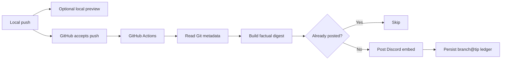

# Engineering Scribe

[](https://github.com/DrGloo/scribe-kit/actions/workflows/test.yml)
[](https://www.python.org/)
[](LICENSE)

Engineering Scribe turns accepted Git pushes into concise Discord development updates. It is a
small, dependency-free Python tool designed for teams that want an engineering journal without
giving an AI model access to their repository or publishing speculative release notes.

The default digest is deliberately factual: commit subjects, authors, changed paths, file
statuses, and diff statistics. It does not claim that a feature works, a bug is fixed, or a
performance target was reached unless your commit subject says so.

## Why Scribe?

Commit feeds are accurate but hard to scan. Handwritten updates are useful but easy to forget.
Scribe sits between them:

- **Readable:** one structured Discord embed per accepted push.
- **Conservative:** no inferred behavior or invented outcomes.
- **Private by design:** source code and diffs never leave GitHub Actions; Discord receives only
  the rendered summary.
- **Deterministic:** the same Git range produces the same digest.
- **Idempotent:** rerunning a workflow does not intentionally post the same branch/tip twice.
- **Portable:** the runtime uses only Python's standard library and is vendored into each project.

## How it works



GitHub Actions is the sole publisher. The local `pre-push` helper only previews output, so a
rejected push cannot create a Discord announcement and local/CI execution cannot double-post.

## Requirements

- Git
- Python 3.10 or newer
- A GitHub repository using Actions
- A Discord webhook stored as a GitHub Actions secret

No runtime packages, API keys, language models, or hosted Scribe service are required.

## Install

Clone the kit once:

```bash
git clone https://github.com/DrGloo/scribe-kit.git
```

Vendor Scribe into any local Git repository:

```bash
./scribe-kit/install.sh /path/to/your-project
```

The installer adds:

```text
.scribe/engineering_scribe/       Vendored runtime
.github/workflows/scribe.yml      Sole Discord publisher
.githooks/scribe-pre-push         Optional preview helper
```

It also ignores `.env` and `.scribe-ci-cache/`. Existing `pre-push` hooks are preserved. If no
`pre-push` exists, the installer creates one from the preview helper.

Commit the installed files in the target project. Vendoring ensures CI runs the same reviewed
version as local previews and prevents an upstream package update from silently changing output.

### Configure the Discord secret

Create a Discord webhook for the destination channel, then add it to the target GitHub repository
as an Actions secret named `SCRIBE_DISCORD_WEBHOOK_URL`:

```bash
gh secret set SCRIBE_DISCORD_WEBHOOK_URL --repo OWNER/REPOSITORY
```

Paste the webhook value when prompted. Never place it in a committed file, command argument,
workflow YAML value, issue, or chat transcript. Rotate it in Discord if it is ever exposed.

### Enable the local preview hook

If the project already uses `.githooks`, no additional setup may be needed. Otherwise, configure
the project to use that directory according to its hook policy. When a project already has a
`pre-push` hook, integrate `.githooks/scribe-pre-push` carefully: Git supplies ref updates on
standard input, so both consumers must receive the same saved input rather than reading it
sequentially.

Local previews are optional. GitHub Actions publishing works without them.

## Preview a digest

From an installed project:

```bash
PYTHONPATH=.scribe python3 -m engineering_scribe.cli \
  --preview \
  --range HEAD~1..HEAD \
  --branch "$(git branch --show-current)"
```

Preview mode prints the exact Discord JSON payload. It performs no network request and writes no
idempotency marker.

## What gets reported

Scribe reads only bounded Git metadata for `BEFORE..AFTER`:

- Non-merge commit SHAs, subjects, and author names
- Added, modified, deleted, and renamed paths
- Aggregate added/deleted line counts
- The origin commit URL when the remote is GitHub or Cursor

Common generated directories, vendored dependencies, and lockfile-only changes are filtered.
Pushes with no substantive paths are suppressed. Multi-author ranges credit each unique author.
Long Discord descriptions are truncated while preserving branch and commit links.

The default message explicitly treats the recorded outcome as a commit-subject claim. This makes
Scribe useful as a journal while avoiding false certainty from filename or diff heuristics.

## Delivery and failure behavior

The workflow caches a bounded ledger keyed by `branch@tip-sha`. Discord delivery:

- Uses a bounded request timeout
- Retries transient network and 5xx failures
- Honors Discord `429 retry_after` responses with a configured cap
- Fails the workflow visibly after retries are exhausted
- Marks an event only after successful publication

A missing webhook secret fails with a clear Actions error. Branch deletions and empty first-commit
ranges are skipped.

## Configuration

Only literal `SCRIBE_*` assignments are read from a local `.env`. Values are not executed as
shell, and existing environment variables take precedence.

```dotenv
SCRIBE_DISCORD_WEBHOOK_URL=
SCRIBE_DISCORD_CONNECT_TIMEOUT=10
SCRIBE_DISCORD_MAX_TIME=30
SCRIBE_DISCORD_RETRIES=3
SCRIBE_DISCORD_MAX_RETRY_AFTER=30
```

Optional controls:

- `SCRIBE_SKIP=1` — suppress an invocation.
- `SCRIBE_ENABLED=0` — disable Scribe.
- `SCRIBE_CACHE_DIR=/path` — override the ledger location.
- `SCRIBE_PREVIEW=1` — force preview mode.

## Customize for your project

The package separates policy from orchestration:

- `PathClassifier.CATEGORY_RULES` maps common paths to categories.
- `NoisePolicy` decides which files are substantive.
- `FactualDigestBuilder` turns observed metadata into prose.
- `DiscordEmbedRenderer` owns Discord formatting and limits.
- `DiscordPublisher` owns bounded delivery and retries.
- `ScribeCoordinator` connects the components.

Extend or replace these classes when a project needs domain-specific categories. Keep factual
collection separate from interpretation so custom output remains auditable.

## Update installed projects

Pull the latest kit and rerun the installer:

```bash
git -C scribe-kit pull --ff-only
./scribe-kit/install.sh /path/to/your-project
```

The installer replaces only the vendored runtime, Scribe workflow, and dedicated preview helper.
It preserves unrelated project files and existing `pre-push` hooks.

Review and commit the generated diff in each target project. Updates are intentionally explicit.

## Development

```bash
python3 -m unittest discover -s tests -v
python3 -m pip install -e .
engineering-scribe --help
```

The test suite covers factual digest generation, noise filtering, Discord payload limits,
idempotency, and non-destructive installation.

## Security

- Webhooks belong in GitHub Actions secrets or an ignored local `.env`.
- Scribe does not log the configured webhook URL.
- Preview mode cannot publish.
- `.env` and local CI cache paths are ignored by default.
- The installer never replaces an existing `pre-push` hook.

If a webhook appears in Git history, revoke it in Discord immediately; removing the text from a
later commit is not sufficient.

## License

MIT
